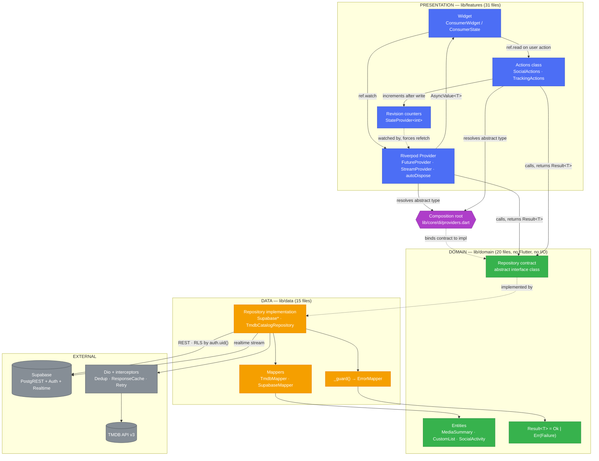

# هم‌سکانس — Schema Tables, Diagrams & Test Summary

Companion to `technical-summary.md`. All field names, types and constraints below are transcribed from the deployed DDL: `lib/data/remote/supabase/supabase_tables.dart` (social subsystem) and `supabase/migrations/0001–0003` (per-user data).

---

## 1. Database Schema Tables

### 1.1 `public_profiles` — public identity

| Field Name | Data Type | Constraints | Description |
|---|---|---|---|
| `user_id` | `text` | **PK** · logical FK → `auth.users.id` | Supabase Auth UUID, stored as text |
| `username` | `text` | `UNIQUE`, `NOT NULL` | The شناسه; the app's login and display handle |
| `login_email` | `text` | nullable *(migration 0002)* | Synthetic `<name>@hamsekans.local` address fixed at signup, so a rename cannot orphan the account |
| `avatar_url` | `text` | nullable | HTTP URL or base64 `data:` URI |
| `bio` | `text` | nullable | Free-text description |
| `total_watched` | `integer` | `DEFAULT 0` | Denormalised counter |
| `favorite_genre` | `text` | nullable | Comma-separated, user-selected (max 3) |
| `created_at` | `timestamptz` | `NOT NULL`, `DEFAULT now()` | Registration time |
| `updated_at` | `timestamptz` | `NOT NULL`, `DEFAULT now()` | Last profile edit |

### 1.2 `user_follows` — directed follow graph

| Field Name | Data Type | Constraints | Description |
|---|---|---|---|
| `follower_id` | `text` | **PK (composite)** · logical FK → `public_profiles.user_id` | The user doing the following |
| `followed_id` | `text` | **PK (composite)** · logical FK → `public_profiles.user_id` | The user being followed |
| `created_at` | `timestamptz` | `NOT NULL`, `DEFAULT now()` | When the follow began |

> Composite PK makes the relation a set: following twice is a no-op rather than a duplicate row. Self-referential many-to-many on `public_profiles`.

### 1.3 `custom_lists` — shared / collaborative lists

| Field Name | Data Type | Constraints | Description |
|---|---|---|---|
| `list_id` | `text` | **PK** | `list_<microsecondsSinceEpoch>` |
| `owner_id` | `text` | `NOT NULL` · logical FK → `public_profiles.user_id` | Creator; sole account able to accept requests or remove collaborators |
| `title` | `text` | `NOT NULL` | List name |
| `description` | `text` | nullable | Optional blurb |
| `is_public` | `boolean` | `DEFAULT true` | `false` hides it from public profiles; joinable only by invitation code |
| `cover_path` | `text` | nullable | Poster of the most recently added item; recomputed on removal |
| `item_count` | `integer` | `DEFAULT 0` | Denormalised, so a profile can render without joining |
| `created_at` | `timestamptz` | `NOT NULL`, `DEFAULT now()` | Creation time |
| `updated_at` | `timestamptz` | `NOT NULL`, `DEFAULT now()` | Last mutation of list or items |

### 1.4 `list_collaborators` — accepted membership

| Field Name | Data Type | Constraints | Description |
|---|---|---|---|
| `list_id` | `text` | **PK (composite)** · **FK → `custom_lists.list_id` `ON DELETE CASCADE`** | Parent list |
| `user_id` | `text` | **PK (composite)** · logical FK → `public_profiles.user_id` | Collaborator |
| `username` | `text` | nullable | Denormalised for rendering without a join |
| `avatar_url` | `text` | nullable | Denormalised avatar |
| `added_at` | `timestamptz` | `NOT NULL`, `DEFAULT now()` | Acceptance time |

> Resolves the many-to-many between `public_profiles` and `custom_lists`. The owner is *not* stored here — ownership lives in `custom_lists.owner_id`.

### 1.5 `custom_list_items` — titles inside a shared list

| Field Name | Data Type | Constraints | Description |
|---|---|---|---|
| `id` | `text` | **PK** | `<list_id>_<media_id>_<media_type>` |
| `list_id` | `text` | **FK → `custom_lists.list_id` `ON DELETE CASCADE`** | Parent list |
| `media_id` | `integer` | `NOT NULL`, part of `UNIQUE` | TMDB id |
| `media_type` | `text` | `NOT NULL`, part of `UNIQUE` | `movie` \| `series` |
| `title` | `text` | `NOT NULL` | Denormalised title |
| `poster_path` | `text` | nullable | Denormalised poster |
| `overview` | `text` | nullable | Denormalised synopsis |
| `release_date` | `text` | nullable | ISO date from TMDB |
| `vote_average` | `double precision` | nullable | TMDB score |
| `added_by` | `text` | `NOT NULL` | Which collaborator added it |
| `added_at` | `timestamptz` | `NOT NULL`, `DEFAULT now()` | Insertion time |
| — | — | `UNIQUE (list_id, media_id, media_type)` | A title cannot appear twice in one list |

> `media_type` is part of the uniqueness constraint because TMDB numbers films and series in a **shared id space** — a film and a series can legitimately collide on `media_id`.

### 1.6 `social_activities` — activity log

| Field Name | Data Type | Constraints | Description |
|---|---|---|---|
| `activity_id` | `text` | **PK** | Deterministic: `<prefix>_<user>_<mediaType>_<mediaId>`; encodes media type because no column exists for it |
| `user_id` | `text` | `NOT NULL` · logical FK → `public_profiles.user_id` | Actor |
| `action_type` | `text` | `NOT NULL` | `watched` \| `reviewed` \| `added_to_list` \| `favourited` \| `followed` \| `diary` \| `collab_request` |
| `movie_id` | `integer` | `NOT NULL` | TMDB id; `0` for follows and access requests |
| `movie_title` | `text` | nullable | Title — **overloaded**: holds the followed user's name for `followed`, and the list id for `collab_request` |
| `movie_poster` | `text` | nullable | Denormalised poster |
| `username` | `text` | nullable | Denormalised actor name |
| `user_avatar` | `text` | nullable | Denormalised avatar; frequently a large base64 `data:` URI |
| `rating` | `double precision` | nullable | Stars, for `reviewed` and `diary` |
| `review_text` | `text` | nullable | Body — **overloaded**: holds request status (`pending`) for `collab_request` |
| `list_title` | `text` | nullable | Target list name for `added_to_list` |
| `created_at` | `timestamptz` | `NOT NULL`, `DEFAULT now()` | Event time; user-chosen watch date for `diary` |

> This table serves three distinct purposes — activity feed, watch diary, and collaboration requests — through column overloading rather than separate tables. It avoided schema changes but is the direct cause of the megabyte-scale realtime payload documented in the summary (§4.3).

### 1.7 Per-user data (migration 0001, RLS-protected)

**`watch_statuses`**

| Field Name | Data Type | Constraints | Description |
|---|---|---|---|
| `user_id` | `text` | **PK (composite)** | Owner, `auth.uid()::text` |
| `media_id` | `integer` | **PK (composite)** | TMDB id |
| `media_type` | `text` | **PK (composite)** | `movie` \| `series` |
| `status` | `text` | `NOT NULL` | `planToWatch` \| `watching` \| `watched` |
| `updated_at` | `timestamptz` | `NOT NULL`, `DEFAULT now()` | Last change |

**`episode_watches`**

| Field Name | Data Type | Constraints | Description |
|---|---|---|---|
| `user_id` | `text` | **PK (composite)** | Owner |
| `episode_id` | `integer` | **PK (composite)** | TMDB episode id |
| `series_id` | `integer` | `NOT NULL` | Parent series |
| `season_number` | `integer` | `NOT NULL`, `DEFAULT 0` | Season |
| `episode_number` | `integer` | `NOT NULL`, `DEFAULT 0` | Episode |
| `runtime_minutes` | `integer` | `NOT NULL`, `DEFAULT 0` | Copied at mark time so watch-time statistics need no refetch |
| `watched_at` | `timestamptz` | `NOT NULL`, `DEFAULT now()` | Mark time |

**`favourites`**

| Field Name | Data Type | Constraints | Description |
|---|---|---|---|
| `user_id` | `text` | **PK (composite)** | Owner |
| `media_id` | `integer` | **PK (composite)** | TMDB id |
| `media_type` | `text` | **PK (composite)** | `movie` \| `series` |
| `created_at` | `timestamptz` | `NOT NULL`, `DEFAULT now()` | When hearted |

**`ratings`**

| Field Name | Data Type | Constraints | Description |
|---|---|---|---|
| `user_id` | `text` | **PK (composite)** | Owner |
| `media_id` | `integer` | **PK (composite)** | TMDB id |
| `media_type` | `text` | **PK (composite)** | `movie` \| `series` |
| `stars` | `integer` | `NOT NULL` | 1–5, validated in the repository |
| `updated_at` | `timestamptz` | `NOT NULL`, `DEFAULT now()` | Last change |

**`reviews`**

| Field Name | Data Type | Constraints | Description |
|---|---|---|---|
| `id` | `text` | **PK** | `review_<user>_<mediaType>_<mediaId>`; deterministic, so re-posting edits |
| `user_id` | `text` | `NOT NULL` | Author |
| `media_id` | `integer` | `NOT NULL` | TMDB id |
| `media_type` | `text` | `NOT NULL` | `movie` \| `series` |
| `body` | `text` | `NOT NULL` | Review text |
| `has_spoiler` | `boolean` | `NOT NULL`, `DEFAULT false` | Blurs the body until tapped |
| `created_at` | `timestamptz` | `NOT NULL`, `DEFAULT now()` | First posted |
| `updated_at` | `timestamptz` | nullable | Last edited |

**`personal_lists`** / **`personal_list_items`**

| Field Name | Data Type | Constraints | Description |
|---|---|---|---|
| `id` | `text` | **PK** | `plist_<microsecondsSinceEpoch>` |
| `user_id` | `text` | `NOT NULL` | Owner |
| `name` | `text` | `NOT NULL` | List name |
| `description` | `text` | nullable | Optional blurb |
| `created_at` | `timestamptz` | `NOT NULL`, `DEFAULT now()` | Creation |

| Field Name | Data Type | Constraints | Description |
|---|---|---|---|
| `list_id` | `text` | **PK (composite)** · **FK → `personal_lists.id` `ON DELETE CASCADE`** | Parent list |
| `media_id` | `integer` | **PK (composite)** | TMDB id |
| `media_type` | `text` | **PK (composite)** | `movie` \| `series` |
| `position` | `integer` | `NOT NULL`, `DEFAULT 0` | User-chosen order |
| `added_at` | `timestamptz` | `NOT NULL`, `DEFAULT now()` | Insertion time |

**`cached_media`** — shared catalogue cache, *not* per-user

| Field Name | Data Type | Constraints | Description |
|---|---|---|---|
| `media_id` | `integer` | **PK (composite)** | TMDB id |
| `media_type` | `text` | **PK (composite)** | `movie` \| `series` |
| `title` | `text` | `NOT NULL` | Title |
| `poster_path` | `text` | nullable | Poster |
| `overview` | `text` | nullable | Synopsis |
| `release_date` | `text` | nullable | ISO date |
| `vote_average` | `double precision` | nullable | TMDB score |
| `runtime_minutes` | `integer` | `NOT NULL`, `DEFAULT 0` | Feeds watch-time statistics |
| `genres` | `text` | `NOT NULL`, `DEFAULT ''` | Comma-separated, for favourite-genre frequency |
| `cached_at` | `timestamptz` | `NOT NULL`, `DEFAULT now()` | Cache time |

**`series_progress_meta`** — progress denominator, *not* per-user

| Field Name | Data Type | Constraints | Description |
|---|---|---|---|
| `series_id` | `integer` | **PK** | TMDB series id |
| `aired_episode_count` | `integer` | `NOT NULL`, `DEFAULT 0` | **Aired only** — unaired episodes excluded, or a caught-up viewer could never reach 100% |
| `has_finished_airing` | `boolean` | `NOT NULL`, `DEFAULT false` | Distinguishes "complete, still running" from "complete, ended" |
| `updated_at` | `timestamptz` | `NOT NULL`, `DEFAULT now()` | Last refresh |

---

## 2. Entity-Relationship Diagram

```mermaid
erDiagram
    AUTH_USERS ||--|| PUBLIC_PROFILES : "identifies"
    PUBLIC_PROFILES ||--o{ USER_FOLLOWS : "follows"
    PUBLIC_PROFILES ||--o{ USER_FOLLOWS : "is followed by"
    PUBLIC_PROFILES ||--o{ CUSTOM_LISTS : "owns"
    PUBLIC_PROFILES ||--o{ LIST_COLLABORATORS : "collaborates via"
    CUSTOM_LISTS ||--o{ LIST_COLLABORATORS : "grants access via"
    CUSTOM_LISTS ||--o{ CUSTOM_LIST_ITEMS : "contains"
    PUBLIC_PROFILES ||--o{ SOCIAL_ACTIVITIES : "performs"
    PUBLIC_PROFILES ||--o{ PERSONAL_LISTS : "owns"
    PERSONAL_LISTS ||--o{ PERSONAL_LIST_ITEMS : "contains"
    PUBLIC_PROFILES ||--o{ WATCH_STATUSES : "records"
    PUBLIC_PROFILES ||--o{ EPISODE_WATCHES : "marks"
    PUBLIC_PROFILES ||--o{ FAVOURITES : "hearts"
    PUBLIC_PROFILES ||--o{ RATINGS : "scores"
    PUBLIC_PROFILES ||--o{ REVIEWS : "authors"
    CACHED_MEDIA ||--o{ WATCH_STATUSES : "described by"
    CACHED_MEDIA ||--o{ FAVOURITES : "described by"
    CACHED_MEDIA ||--o{ PERSONAL_LIST_ITEMS : "described by"
    SERIES_PROGRESS_META ||--o{ EPISODE_WATCHES : "bounds progress of"

    AUTH_USERS {
        uuid id PK
        text email "synthetic user@hamsekans.local"
        text encrypted_password
    }
    PUBLIC_PROFILES {
        text user_id PK "auth.uid() as text"
        text username UK
        text login_email "fixed at signup"
        text avatar_url
        text bio
        int total_watched
        text favorite_genre "up to 3, comma separated"
    }
    USER_FOLLOWS {
        text follower_id PK,FK
        text followed_id PK,FK
        timestamptz created_at
    }
    CUSTOM_LISTS {
        text list_id PK
        text owner_id FK
        text title
        bool is_public "false = invite code only"
        text cover_path "recomputed on removal"
        int item_count "denormalised"
    }
    LIST_COLLABORATORS {
        text list_id PK,FK
        text user_id PK,FK
        text username "denormalised"
        text avatar_url "denormalised"
    }
    CUSTOM_LIST_ITEMS {
        text id PK
        text list_id FK
        int media_id UK
        text media_type UK "movie or series"
        text title
        text added_by
    }
    SOCIAL_ACTIVITIES {
        text activity_id PK "encodes media type"
        text user_id FK
        text action_type "7 kinds incl diary, collab_request"
        int movie_id "0 for follows"
        text movie_title "overloaded"
        text review_text "overloaded"
        float rating
    }
    PERSONAL_LISTS {
        text id PK
        text user_id FK
        text name
    }
    PERSONAL_LIST_ITEMS {
        text list_id PK,FK
        int media_id PK
        text media_type PK
        int position
    }
    WATCH_STATUSES {
        text user_id PK
        int media_id PK
        text media_type PK
        text status "planToWatch watching watched"
    }
    EPISODE_WATCHES {
        text user_id PK
        int episode_id PK
        int series_id
        int runtime_minutes "copied at mark time"
    }
    FAVOURITES {
        text user_id PK
        int media_id PK
        text media_type PK
    }
    RATINGS {
        text user_id PK
        int media_id PK
        text media_type PK
        int stars "1 to 5"
    }
    REVIEWS {
        text id PK "deterministic"
        text user_id FK
        int media_id
        text body
        bool has_spoiler
    }
    CACHED_MEDIA {
        int media_id PK
        text media_type PK
        text title
        int runtime_minutes
        text genres "comma separated"
    }
    SERIES_PROGRESS_META {
        int series_id PK
        int aired_episode_count "aired only"
        bool has_finished_airing
    }
```



> Only two foreign keys are **declared** in the database (`list_collaborators` and `custom_list_items` → `custom_lists`; `personal_list_items` → `personal_lists`). Every association to a user is **logical**, because `user_id` is `text` while `auth.users.id` is `uuid`. Referential integrity for account deletion is therefore enforced by the `after delete on auth.users` trigger in migration 0003 rather than by constraints.

---

## 3. Clean Architecture Flow Diagram



### 3.1 Worked example — marking a title watched

```mermaid
sequenceDiagram
    autonumber
    participant U as User
    participant TB as TrackingBar (widget)
    participant TA as TrackingActions
    participant TR as TrackingRepository<br/>(contract)
    participant SR as SupabaseTrackingRepository
    participant SB as Supabase
    participant RV as socialActivityRevisionProvider
    participant PR as Profile / diary providers

    U->>TB: taps «مشاهده شده»
    TB->>TA: setStatus(item, watched)
    TA->>TR: setStatus(...)
    Note over TR,SR: contract resolved by the DI root;<br/>the widget never names the impl
    TR->>SR: dispatch
    SR->>SB: upsert cached_media
    SR->>SB: upsert watch_statuses (idempotent on composite PK)
    SR->>SB: insert social_activities (deterministic id)
    SB-->>SR: 2xx
    SR-->>TA: Ok(void)
    TA->>RV: state++
    RV-->>PR: invalidates dependents
    PR->>SB: refetch
    PR-->>TB: AsyncValue.data → rebuild
```

---

## 4. Test Summary

| Category | Files | Scope |
|---|---:|---|
| Architecture | 2 | Import-direction enforcement (fails build on violation); DI seam with a fake repository |
| Core / infrastructure | 4 | Dedup + response-cache interceptors, error mapping, Persian number & Jalali formatting |
| Data / repository | 10 | Auth, tracking, reviews, social, user isolation, TMDB client & mapper, watch-status rules, shared-list covers, diary privacy |
| Domain / pure logic | 7 | Watch progress, aired-episode count, rating summary, social models, diary dedupe, invite codes, activity media type |
| Widget | 14 | RTL layout regression, bidi text, status picker, watchlist sections, diary modal, social screens, collaborative-list rendering, statistics |
| **Total** | **37** | **247 tests — all passing** |

| Quality gate | Command | Result |
|---|---|---|
| Test suite | `flutter test --dart-define-from-file=dart_defines.json` | ✅ **247 / 247 passing** |
| Static analysis | `flutter analyze` | ✅ **No issues found** |
| Lint ruleset | `analysis_options.yaml` | `flutter_lints` + ~40 additional rules (`avoid_dynamic_calls`, `directives_ordering`, `prefer_const_constructors`, `use_null_aware_elements`) |
| Release build | `flutter build apk --debug` | ✅ Builds and installs on device (Android 16, API 36) |

| Coverage gap | Status |
|---|---|
| Integration / end-to-end in CI | ❌ None. Cross-device account behaviour verified once manually, then the probe was deleted rather than kept as a fixture |
| Supabase repositories against a fake PostgREST | ❌ Offline branches covered via `client: null`; network branches untested |
| Widget tests vs. real backend | ⚠️ Auth and tracking are faked (`test/support/fake_auth.dart`); screens are verified, integration is not |
| Tests removed during cloud migration | ⚠️ 2 deleted — `provider_account_switch_test.dart` (subject no longer exists) and `render_all_real_lists_test.dart` (passing vacuously; never reached the network under `flutter test`) |
